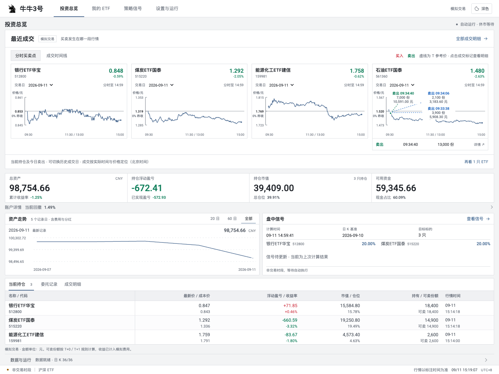
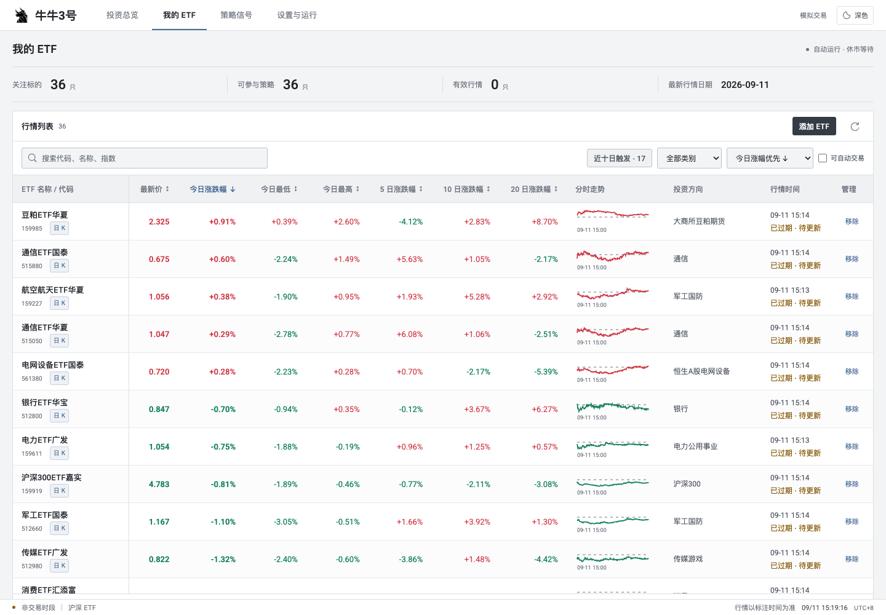
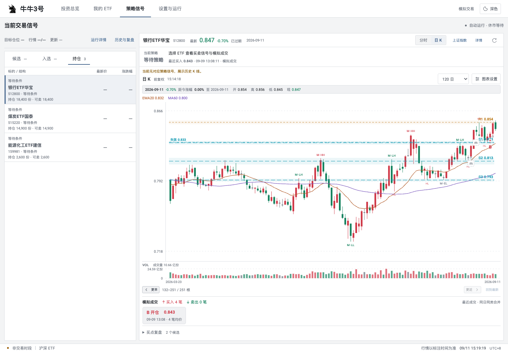
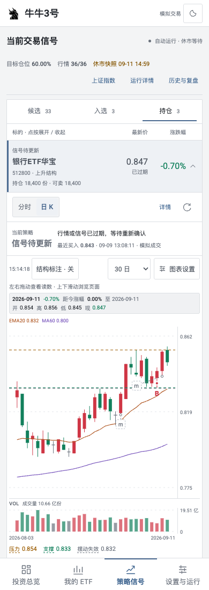
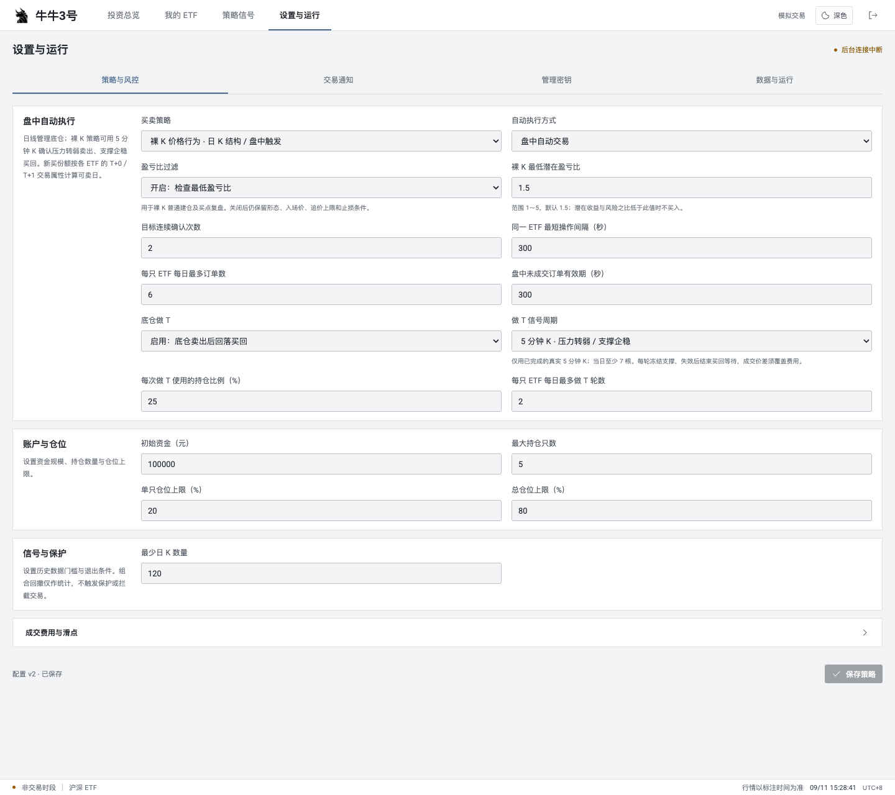
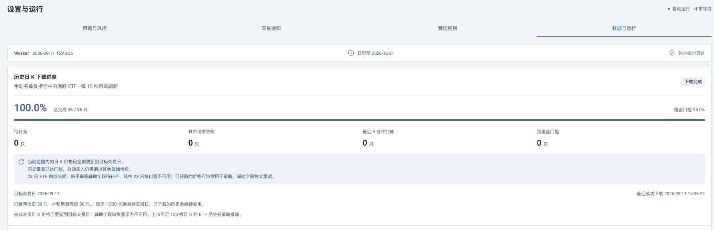

面向沪深上市 ETF 的行情观察、策略研究与自动模拟交易工作台。

通过手动维护 ETF 名单，查看分时与日 K、跟踪策略信号，并在本地模拟账户中记录订单、成交和资产变化。后台独立运行，关闭浏览器后仍会按交易时段采集数据、计算策略和检查模拟订单。

**所有交易均发生在模拟账本中，项目没有券商连接或实盘下单接口。**

[在线示例](https://niualpha.com) · [功能介绍](#功能介绍) · [快速启动](#快速启动) · [本地开发](#本地开发) · [详细文档](#详细文档) · [Apache License 2.0](LICENSE)

## 功能介绍

以下截图拍摄于 2026-09-11，均为浅色主题下的实际界面：账户、行情、移动端和运行状态截图来自收盘后的运行站点，策略配置截图来自独立本地示例环境。页面默认使用浅色，也可切换深色并保存浏览器偏好。

### 投资总览：掌握账户与成交

集中查看总资产、持仓盈亏、可用资金和资产走势，结合当前持仓、委托记录与成交明细，了解模拟账户的变化。账户详情还可查看费用、分红与折算记录。

分时卡片将真实模拟成交按时间与价格标在走势上，方便回看买卖发生在哪一段行情。卡片覆盖当前持仓和今日实际卖出的 ETF，今日已清仓的标的也会保留，便于继续观察买回机会。



### 我的 ETF：维护观察名单

按代码或名称搜索并手动添加 ETF，在同一张列表中对比最新报价、多日涨跌幅和分时缩略图。选择标的后可进一步查看分时走势与前复权日 K，把日常关注的 ETF 纳入自己的观察范围。



### 策略信号：筛选标的与图表复盘

使用「候选、入选、持仓」三栏组织标的，将观察名单、策略目标与账户实际持仓对应起来。

| 栏目 | 含义                                                                     |
| ---- | ------------------------------------------------------------------------ |
| 候选 | 观察范围内尚未被策略选中的 ETF                                           |
| 入选 | 策略筛选出的目标；盘后展示满足次日参考条件的 ETF，仍需盘中确认           |
| 持仓 | 账户实际持有的 ETF，显示持有与可卖份额；即使暂时没有对应策略信号也会保留 |

入选与持仓可以重合。信号、委托和实际成交分别展示，入选不等于已经买入。

选择 ETF 后，可切换分时与日 K，按需显示均线、成交量、MACD、支撑压力、摆动点和价格行为图层，并结合历史成交及买点复盘查看信号所在的行情结构。



### 移动端：在列表内展开图表

点按策略列表中的 ETF，图表直接在该行下方展开，再次点按即可收起。切换标的时展开对应图表，列表与行情保持在同一处；展开后可直接切换分时和日 K。



### 策略与风控：配置模拟交易与做 T

在「设置与运行 → 策略与风控」选择趋势动量轮动或裸 K 价格行为，配置自动执行方式、持仓数量、仓位上限、成交费用与撮合参与率。后台根据配置采集数据、计算信号并检查模拟订单，关闭浏览器后仍会继续运行。

裸 K 策略支持 **5 分钟做 T**：使用真实、已完成的分钟 K 线观察压力转弱与支撑企稳，支持底仓卖出后回落买回的模拟流程。买回参考、卖出参考和失效价以**水平虚线**直接标在分时图中，当前持仓及今日已清仓标的都可继续查看参考。

参考价与真实成交标记分别展示。仅有参考价或历史卖出记录不会直接触发买入；实际执行仍需满足策略、可卖份额、仓位、费用和行情有效性等条件。分钟数据缺失或过期时不补造点位。

下图展示本地示例启用裸 K 和分钟做 T 后的配置界面，启用步骤见[启用裸 K 与 5 分钟做 T](#启用裸-k-与-5-分钟做-t)。



### 数据与运行：跟踪后台任务

在「数据与运行」查看历史行情补充进度、worker 心跳、交易日历、账本核对结果和运行记录，并调整行情刷新与调度参数。行情未齐、过期或处于休市时，可结合等待原因了解当前状态。

「交易通知」支持飞书、钉钉、企业微信和 Telegram，可配置渠道并查看发送结果；「管理密钥」用于修改管理密码。账户、配置、订单和成交持久保存在 SQLite 中。

下图展示运行站点完成当日日 K 更新后的状态：36 只 ETF 的价格数据全部更新到目标交易日，worker 心跳正常、账本核对通过；成交额、换手率等辅助字段的补齐进度单独显示。



## 快速启动

需要 Docker Engine 与 Docker Compose v2，或 Docker Desktop。获取源码并进入项目根目录后运行：

```bash
docker compose up -d --build --wait
docker compose ps
```

打开 [http://127.0.0.1:8789](http://127.0.0.1:8789)。也可以使用项目内的 `./run.sh`，Windows 使用 `run.bat`。

首次构建会安装 Python 和前端依赖。数据采集需要能够访问公开行情源；页面可访问与交易数据就绪是两个独立状态。

### 首次使用

1. 进入「我的 ETF」，点击「添加 ETF」，选择搜索结果并确认添加。
2. 添加、移除和修改配置时需要管理密码；查看总览、行情与策略信号无需登录。
3. 在「设置与运行」中配置策略、仓位和通知，在「数据与运行」查看资料及历史行情的补充进度。
4. 名单与数据就绪后，后台在相应交易时段自动执行。休市、行情过期或数据未齐时会显示等待原因，无需手动启动或恢复。

未指定初始管理密码时，首次启动会在数据卷中生成密码。可在本机读取：

```bash
docker compose exec dashboard cat /data/admin-token.txt
```

也可以在首次启动前，参考 [.env.example](.env.example) 创建 `.env` 并设置 `NIUNO3_ADMIN_PASSWORD`。已有实例通过「设置与运行 → 管理密钥」修改密码；更改环境变量不会重置已初始化的密码。

### 启用裸 K 与 5 分钟做 T

**新部署默认使用趋势动量策略与日频调仓。** 如需使用裸 K 及分钟做 T，在「设置与运行 → 策略与风控」配置：

| 设置          | 选项                           |
| ------------- | ------------------------------ |
| 买卖策略      | 裸 K 价格行为                  |
| 自动执行方式  | 盘中自动交易                   |
| 底仓做 T      | 开启                           |
| 做 T 信号周期 | 5 分钟 K · 压力转弱 / 支撑企稳 |

裸 K 底仓策略使用已完成日 K 形成结构，再由盘中报价触发；分钟做 T 独立使用真实 5 分钟 OHLCV。保存策略参数后会重新确认目标并处理旧参数下的待成交意图，历史成交与账本保留。规则见 [裸 K 与分钟做 T](docs/price-action-strategy.md)。

## 配置与运行

Compose 读取根目录 `.env`，支持以下部署配置：

| 环境变量                 | 默认值       | 用途                                        |
| ------------------------ | ------------ | ------------------------------------------- |
| `NIUNO3_ADMIN_PASSWORD`  | 空，自动生成 | 仅用于首次初始化管理密码                    |
| `NIUNO3_BIND_ADDRESS`    | `127.0.0.1`  | 宿主机监听地址                              |
| `NIUNO3_PORT`            | `8789`       | 宿主机访问端口                              |
| `NIUNO3_TRUSTED_PROXIES` | 空           | 可信反向代理的 IP 或 CIDR，多个值用逗号分隔 |

策略、费用、刷新间隔及通知渠道在网页中管理，并持久化到数据库。分时刷新间隔是独立的展示设置，单独修改不会重置交易策略。

### 服务结构

| 服务          | 职责                                                              |
| ------------- | ----------------------------------------------------------------- |
| `dashboard`   | FastAPI 接口、管理认证与 Vue 静态页面，默认只映射本机 `8789` 端口 |
| `worker`      | 行情与历史数据采集、策略计算、风险检查、模拟撮合和交易通知        |
| SQLite 数据卷 | 两个服务共享账户、配置、行情缓存和交易证据                        |

后端采用 Python / FastAPI，前端采用 Vue 3 / Vite，数据库为 SQLite。裸 K 策略通过 Node.js 复用前端价格行为引擎，使策略与图表采用相同的结构计算逻辑。

关闭页面不影响 worker。宿主机和 Docker 需要持续运行；服务退出后由 Compose 的 `unless-stopped` 策略恢复。

### 更新与检查

更新代码后，在项目根目录执行：

```bash
docker compose up -d --build --wait
curl --fail http://127.0.0.1:8789/healthz
docker compose ps
```

仅前端修改时，可以只更新 dashboard：

```bash
docker compose up -d --build --no-deps --wait dashboard
```

查看后台日志：

```bash
docker compose logs --tail=80 worker
```

| 检查入口         | 含义                                                        |
| ---------------- | ----------------------------------------------------------- |
| `/healthz`       | Web 服务与数据库可访问                                      |
| `/readyz`        | 交易数据、日历、worker 心跳及账本等就绪检查；未就绪返回 503 |
| `/api/v1/status` | 详细运行状态、等待原因和下载进度                            |

首次启动尚无 ETF、历史数据未齐或处于休市时，应结合页面状态查看具体原因，不能仅凭 `/healthz` 判断是否会模拟成交。公网反向代理与 Cloudflare Tunnel 配置见 [部署与维护](docs/operations.md)。

### 数据与备份

Compose 将数据保存在命名卷 `niuno3_niuno3-data`，数据库路径为容器内的 `/data/niuno3.sqlite3`。常规重建容器保留数据。

```bash
# 核对账本
docker compose exec dashboard python -m scripts.audit

# 创建一致的在线备份；每次使用新的文件名
docker compose exec dashboard python -m scripts.audit --backup /data/backup-before-update.sqlite3
mkdir -p backups
docker compose cp dashboard:/data/backup-before-update.sqlite3 ./backups/
```

停止正式实例时可使用 `docker compose stop`；不要执行 `docker compose down -v`，它会删除账户数据卷。恢复步骤与数据留存规则见 [部署与维护](docs/operations.md)。

## 本地开发

需要 Python 3.11+（建议 3.12）、uv、Node.js 22.12+ 和 pnpm 11.19.0。Node.js 同时用于前端构建与裸 K 策略运行。

安装依赖并构建前端：

```bash
uv sync --locked --python 3.12
pnpm --dir web install --frozen-lockfile
pnpm --dir web build
```

在两个终端中分别启动服务：

```bash
# 终端 1：接口与已构建的页面
uv run python -m app.entrypoints.dashboard
```

```bash
# 终端 2：后台采集与模拟交易
uv run python -m app.entrypoints.worker
```

开发前端时，可另开终端启用热更新：

```bash
pnpm --dir web dev
```

Vite 默认在 `http://127.0.0.1:5173` 提供页面，将 `/api` 代理到本机 `8789`；已有 Docker dashboard 占用该端口时，应先为本地开发安排可用端口并同步修改代理配置。

直接运行 Python 时，默认使用项目根目录 `.local-data/`，不会自动读取 Docker 数据卷。可通过 `NIUNO3_DATA_DIR` 指定独立目录，通过 `NIUNO3_HOST`、`NIUNO3_PORT` 配置 Web 服务。根目录 `.env` 由 Compose 读取，直接运行 Python 时需自行设置 shell 环境变量。

## 验证与贡献

完整代码检查、测试与前端构建：

```bash
./scripts/validate.sh
```

单独运行后端或前端测试：

```bash
uv run python -m unittest discover -s tests -v
pnpm --dir web test
```

使用独立 Compose 项目验证两日模拟交易与重启流程：

```bash
docker compose build
./scripts/acceptance.sh
```

验收脚本使用独立的 `niuno3-acceptance` 项目和测试数据卷；若同名测试卷已存在会停止，成功后清理自己的测试环境。历史验证范围与结果见 [验收记录](docs/verification.md)。

提交信息遵循 `type(scope): subject`，使用英文单行标题、小写动词开头，不写正文。例如：

```text
feat(dashboard): add account holdings to signal tabs
fix(trading): preserve pending buyback quantities after restart
docs(readme): clarify local development setup
```

贡献前阅读 [AGENTS.md](AGENTS.md)。不要提交 `.env`、`.local-data/`、账户数据库、密钥、日志或备份。

## 项目结构

```text
app/
  core/           配置、证券类型、金额与交易日历
  market_data/    行情、历史日 K、分钟 K 与基金资料适配
  strategies/     趋势动量、裸 K 价格行为与分钟做 T
  trading/        账户、模拟撮合、仓位与公司行动
  storage/        SQLite、状态、数据维护与持久化
  automation/     worker 调度与策略目标
  dashboard/      API、管理认证与图表数据
  entrypoints/    Web、worker 与健康检查入口
web/
  src/            Vue 页面、图表与共享价格行为引擎
  tests/          前端逻辑测试
config/           交易日历与基础分类
scripts/          校验、账本核对、备份与验收工具
tests/            Python 单元及集成测试
docs/             策略、数据口径与运维说明
```

## 详细文档

| 文档                                             | 内容                                   |
| ------------------------------------------------ | -------------------------------------- |
| [裸 K 与分钟做 T](docs/price-action-strategy.md) | 结构确认、入场退出、分钟做 T 与复盘    |
| [趋势动量与撮合规则](docs/strategy.md)           | 动量策略、日频调仓与模拟成交假设       |
| [数据来源与质量](docs/data.md)                   | 各类行情来源、时效、缺失数据与缓存口径 |
| [部署与维护](docs/operations.md)                 | 环境、认证、接口、备份和公网部署       |
| [交易通知](docs/notifications.md)                | 飞书、钉钉、企业微信与 Telegram 配置   |
| [价格行为图层](docs/niutwo-indicators.md)        | 指标图层、计算边界与迁移说明           |
| [验收记录](docs/verification.md)                 | 历次测试及界面验证范围                 |

公开数据可能延迟或缺失，页面会保留来源时间与缓存状态；模拟执行依赖有效行情及账户检查。分钟参考、图表复盘和模拟成交记录分别展示。

## 开源协议

本项目采用 [Apache License 2.0](LICENSE)，版权所有 © 2026 dijunkun。

第三方依赖与资源保留各自的许可证；Roboto 字体使用 [SIL Open Font License 1.1](web/public/assets/licenses/Roboto-OFL.txt)。
